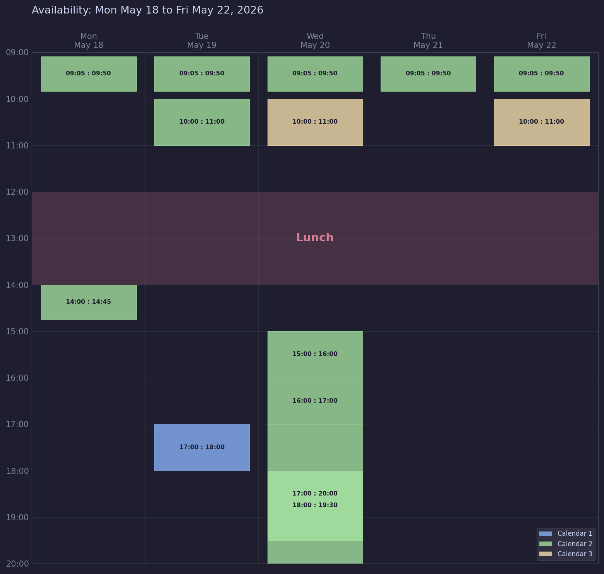

# Calendar Availability Exporter

**Share your weekly availability without leaking what's on your calendar.**
A native macOS app (and a Python CLI) that reads only the structural metadata of your events — start, end, source calendar, all-day flag — and renders a fresh, paste-anywhere availability chart. Event titles, attendees, notes, and locations are never loaded into memory in the first place, so there is nothing to redact.




## Why I built it

When someone asks *"when are you free next week?"*, the usual options all bad:

1. Keep a handwritten list of free slots — tedious, instantly stale.
2. Share your full calendar — leaks confidential meeting details to the world.
3. Screenshot Calendar.app and manually black out titles — fragile, slow, embarrassing if you miss one.

I wanted a fourth option: a one-click chart of *when I'm blocked*, with **zero** event content ever in the rendered image. This project is that fourth option.

## Two ways to use it

|                 | **Mac app** *(recommended)*                                       | **Python CLI**                                  |
|-----------------|-------------------------------------------------------------------|-------------------------------------------------|
| Best for        | Daily ad-hoc use, sharing in chat / email                        | Automation, scripting, scheduled exports        |
| UI              | Native SwiftUI with Liquid Glass                                  | Command line                                    |
| Requires        | macOS 26 (Tahoe)                                                  | macOS 11+, Python 3.10+                         |
| Output          | Clipboard (one click) or PNG                                      | PNG file                                        |
| Install         | Drop the prebuilt `.app` from [Releases][releases] into `/Applications` | `pip install -e .`                          |
| Source          | [`macapp/`](macapp/)                                              | [`src/calendar_availability/`](src/calendar_availability/) |

Both share the same anonymization model.

[releases]: ../../releases/latest

## Anonymization model

The data flow is deliberately narrow. The `AnonymizedEvent` model exposes exactly four fields:

| Field      | Type       | Purpose                                  |
|------------|------------|------------------------------------------|
| `start`    | `datetime` | When the event begins                    |
| `end`      | `datetime` | When the event ends                      |
| `calendar` | `str`      | Source calendar title (filter only)      |
| `all_day`  | `bool`     | Render as a top strip instead of a block |

Title, notes, location, attendees, URLs, and attachments are **never read** from the EventKit objects. They cannot end up in logs, debug output, swap, or the rendered PNG because they are never loaded.

This is anonymization *by construction*, not post-hoc redaction. The Swift `AnonymizedEvent` in the Mac app mirrors the same boundary.

The Mac app additionally differentiates events by their EventKit availability class (busy / tentative / free / unavailable) with both color **and** texture so the screenshot stays readable in greyscale and for colorblind viewers. The CLI still draws one generic color per calendar with anonymous legend labels (`Calendar 1`, `Calendar 2`, …) so calendar names also never appear in the output image.

## Mac app

The native app lives in [`macapp/`](macapp/). See [`macapp/README.md`](macapp/README.md) for build and install instructions, or grab a prebuilt `.app` from the [Releases page][releases].

Highlights:

- **One click to clipboard** — ⌘↩ renders the chart at 3600×2200 and copies a PNG to the pasteboard for paste-anywhere workflows. ⌘S also saves to disk and copies in one shot.
- **Timezone picker** — defaults to system timezone, shown as a subtitle on the chart, with full IANA database access.
- **Weekend toggle** — Mon–Fri or Mon–Sun.
- **Availability filtering** — Busy / Tentative / Free / Unavailable each get a distinct color *and* texture (solid, diagonal stripes, dashed outline, cross-hatch). Free is off by default so events explicitly marked Free don't pollute the "blocked time" screenshot.
- **Calendar multi-select** — limit the chart to specific calendars.

## Python CLI

<details>
<summary><b>Click to expand the CLI reference</b> — install, usage flags, Python API, launchd automation</summary>

The CLI lives in [`src/calendar_availability/`](src/calendar_availability/) and works on any macOS 11+ system with Python 3.10+. Useful for automated/scheduled exports.

### Installation

Use a project-local virtual environment. Conda's `base` environment mixes pip and conda state and can produce ABI mismatches between matplotlib and NumPy.

```bash
git clone https://github.com/MMeirelless/calendar-availability-exporter.git
cd calendar-availability-exporter
python3 -m venv .venv
source .venv/bin/activate
pip install -e .
```

If you do not want to install the package, the script also runs as a module after dependencies are installed:

```bash
python3 -m venv .venv
source .venv/bin/activate
pip install -r requirements.txt
python -m calendar_availability --help
```

#### Anaconda users

Prefer a dedicated env over `base`:

```bash
conda create -n cal-availability python=3.12 -y
conda activate cal-availability
pip install -e .
```

#### Troubleshooting matplotlib

If you see `_ARRAY_API not found` or `numpy.core.multiarray failed to import`, matplotlib was compiled against NumPy 1.x and your environment has NumPy 2.x. matplotlib 3.9 is the first release with NumPy 2 support. Upgrade matplotlib inside your active env:

```bash
pip install -U "matplotlib>=3.9"
```

This is the symptom you get when running directly inside Anaconda's `base` without a fresh env.

### First run: grant Calendar access

On the first run, macOS displays a permission prompt for Calendar access. Approve it.

If you run the tool from Terminal, Terminal itself also needs Calendar access. You can verify or grant it manually in:

```
System Settings > Privacy & Security > Calendars
```

If access is revoked or denied, the tool exits with a clear message pointing to the same path.

### Usage

Basic week export:

```bash
calendar-availability \
  --start 2026-05-18 \
  --end   2026-05-22 \
  --day-start 09:00 \
  --day-end   20:00 \
  --output availability.png
```

Filter to specific calendars (case insensitive substring match):

```bash
calendar-availability \
  --start 2026-05-18 --end 2026-05-22 \
  --calendars "Work,Personal"
```

Add a lunch overlay:

```bash
calendar-availability \
  --start 2026-05-18 --end 2026-05-22 \
  --lunch 12:00-14:00
```

Maximum anonymization (hide event time labels, only show colored blocks):

```bash
calendar-availability \
  --start 2026-05-18 --end 2026-05-22 \
  --no-times
```

Run as a module without installing the entry point:

```bash
python -m calendar_availability --start 2026-05-18 --end 2026-05-22
```

### Configuration reference

| Flag | Default | Description |
|------|---------|-------------|
| `--start` | required | First day of the window (`YYYY-MM-DD`) |
| `--end` | required | Last day of the window (`YYYY-MM-DD`) |
| `--day-start` | `09:00` | First visible hour |
| `--day-end` | `20:00` | Last visible hour |
| `--output` | `availability.png` | Output PNG path |
| `--calendars` | all | Comma separated calendar name substrings to include |
| `--lunch` | none | Lunch overlay window, e.g. `12:00-14:00` |
| `--no-times` | off | Hide `HH:MM` labels inside event blocks |

### Python API

```python
from datetime import date, datetime, time
from pathlib import Path
from EventKit import EKEventStore

from calendar_availability import fetch_events, render
from calendar_availability.eventkit_client import request_calendar_access

store = EKEventStore.alloc().init()
if not request_calendar_access(store):
    raise SystemExit("Calendar access denied")

events = fetch_events(
    store,
    datetime(2026, 5, 18, 0, 0),
    datetime(2026, 5, 22, 23, 59),
    calendar_filter=["Work"],
)

render(
    events=events,
    start_date=date(2026, 5, 18),
    end_date=date(2026, 5, 22),
    day_start=time(9, 0),
    day_end=time(20, 0),
    lunch=(time(12, 0), time(14, 0)),
    output_path=Path("availability.png"),
    show_times=True,
)
```

### Automating weekly exports

A shell wrapper plus a launchd agent is the cleanest way to regenerate the current week on a schedule. See [`examples/weekly_export.sh`](examples/weekly_export.sh) and the launchd snippet in [`examples/README.md`](examples/README.md).

### Development

```bash
make install    # Editable install with dev dependencies
make lint       # ruff check
make format     # ruff format
make test       # pytest
make clean      # Remove build artifacts and caches
```

</details>

## Project structure

```
calendar-availability-exporter/
├── README.md
├── LICENSE                              # Prosperity Public License 3.0.0
├── CHANGELOG.md
├── pyproject.toml
├── requirements.txt
├── Makefile
├── .gitignore
├── src/
│   └── calendar_availability/
│       ├── __init__.py                 # Package init, version, public API
│       ├── __main__.py                 # Enables `python -m calendar_availability`
│       ├── cli.py                      # argparse, validates input, orchestrates
│       ├── eventkit_client.py          # EventKit access, permission handling
│       ├── models.py                   # AnonymizedEvent (anonymization boundary)
│       ├── render.py                   # matplotlib rendering
│       └── theme.py                    # Color palette constants
├── macapp/                             # Native SwiftUI Mac app — see macapp/README.md
│   ├── Package.swift
│   ├── Info.plist
│   ├── build.sh                        # Build the .app bundle
│   ├── install.sh                      # Copy bundle into /Applications
│   ├── Resources/AppIcon.png           # 1024×1024 source for the app icon
│   └── Sources/CalendarAvailability/   # SwiftUI app sources
├── examples/
│   ├── README.md
│   └── weekly_export.sh                # CLI wrapper used by launchd
├── tests/
│   ├── __init__.py
│   └── test_models.py                  # Asserts AnonymizedEvent stays minimal
└── docs/
    ├── README.md
    └── availability_example.png        # Hero screenshot used in this README
```

## Roadmap

- ICS file fallback for non-macOS systems (read exported `.ics` instead of EventKit)
- SVG output for vector sharing
- `--free` inverse mode that highlights free slots instead of busy slots
- Microsoft 365 backend (read availability from Outlook directly)
- Multi-week view (4-week strip for longer planning horizons)

## License

Licensed under the **Prosperity Public License 3.0.0** — free for personal, hobby, academic, and other noncommercial use forever, with a 30-day commercial trial. Commercial users must contact the maintainer to license production use. See [LICENSE](LICENSE) for the full text.

> The Prosperity license keeps the source visible and modifiable for everyone, while reserving commercial / resale rights to the maintainer. Use it at home, study it, contribute fixes — all welcome. Use it to run a paid product? Get in touch.

## Maintainer

Built and maintained by Matheus Meirelles ([@MMeirelless](https://github.com/MMeirelless)).
